# Two-Pass-Assembler
Computer Organisation Project 1: 
- [Problem Statement](https://drive.google.com/file/d/1Nk27bWucDA3GjHa-ctjzw_sy3Gpo2gLi/view)
- [Sample Test File](https://drive.google.com/file/d/1i_Q7dkn1AObVsxCBYJJm97HxX9NX8i2t/view)

## Sample Codes:
1. [What is two pass assembler - AyushOriginal Github repo readme](https://github.com/ayushoriginal/Two-pass-Assembler)
2. [Assembler in Python - David Johnson GitHub repo](https://github.com/dmjio/Assembler.py/blob/master/Assembler.py)

## Lecture Slides:
1. [The Assembly Language Level](https://drive.google.com/file/d/1VY4L8w2w9N_DBvwpF7Sk6Lt7lCgoLvfM/view)
2. [The Assembly Process](https://drive.google.com/file/d/1q6BmgxjwqpT0s-BL8oym3uBhGwxyoaiu/view)

## Helpful Webpages:
1. [General errror](https://www.freepascal.org/docs-html/current/user/usersu100.html)

---
# Documentation
---
## Project 1 - Two Pass Assembler

### Course: CSE112 Computer Organization <br> 

Project Members: <br>
1. Bhavya Chopra - 2018333  <br>
2. Sonali Singhal - 2018317

## Assumptions

### General
1. Clear accumulator (CLR) resets the accumulator. No address or value is present in the accumulator.
2. Execution stops after the end statement. The code written after the end statement is not executed.
3. START does **not** need to be specified in the code and it is treated as an assembler directive if used.
4. Label name **cannot** be an opcode name and cannot have a Macro name anywhere in it. <br> For example if ADDTWO is a macro, then: "SUB", "ADD", "ADDTWOXYZ" are invalid label names. While this can be handled easily, it is not considered to be a good programming practice.
5. Comments can be added with the help of  **; or /**.
6. Variable names and label names can be alpha-numeric. However, the same variable cannot be used as a label name and vice versa.
7. Literals can be of any value, contiguous memory spaces are allotted accordingly.
9. If the size of the literal uses more than 1 memory space, then only the first is written in the machine code. Remaining memory mapping can be seen from the LiteralTable.
9. The maximum memory size is 256 words, which can be stored using 8 bit addresses. If the program size is greater than this, the assembler will throw an error and terminate.

### Macros
1. Macros can be handled.
2. Macro is defined at the top of the file before being called.
3. Macro calls cannot be made inside other macro definitions.

### Operands
1. For opcodes ADD, MUL and SUB, operand should be a defined address/variable or a constant.
2. For opcodes BRP, BRN and BRZ, operand should be a defined valid label.
3. For opcodes SAC, INP and LAC, operand should be an address/variable (not a constant).
4. For the opcode DSP, operand should be a declared adress/variable, and not a constant.
4. DIV should have operand as declared address/variable or constant. 

---

## Design
### 1. Data Table
**Contains all the (numeric) addresses defined in the code**
1. **Value:** Integer address value
2. **Defined/Undefined:** Defined if the address is taking in a value using INP. Eg INP 157, else undefined
Example: <br>
```
INP 157
LAC 157
DIV 157
```

|Value|Defined/Undefined|
|-----|-----------------|
|157  |Defined          |

### 2. Label Table
**Contains all the Labels defined in the main code and the modified labels created after expanding macro calls.**
1. **Label name:** Name of the label as defined in the code
2. **Virtual Address:** Virtual address allotted to the label during the first pass
3. **Code:** refers to the name of the macro or Main code
4. **Physical Address:** Physical address allotted to the label during the second pass

Example: <br>
```
ADDTWO MACRO A,B,C
L1: LAC A
ADD B
SAC C
MEND
L1: INP 157
LAC 157
ADDTWO 157 '4' 90
``` 

|Name     |Virtual Address  |Code     |Physical Address|
|---------|-----------------|---------|----------------|
|L1       |00000000     |Main     |00000010    |
|ADDTWOL11|00000010     |ADDTWO   |00000100    |

### 3. Symbol Table
**Contains all the variables defined in the main code**
1. **Name:** Variable name defined in the main code
2. **Physical Address:** Physical address allotted to the variable during the second pass

Example: <br>
```
INP A
SAC B
```

|Name |Physical Address |
|-----|-----------------|
|A    |01001010     |
|B    |01001110     |

### 4. Literal Table 
**Contains all the constants defined in the code**
1. **Name:** String value of the constant eg ‘1’
2. **Value:** Integer value of the literal
3. **Size:** Word size of the literal considering 2s complement for storing data
4. **Physical address:** Physical address allotted to the Literal during the second pass

Example: <br>
```
ADD '128'
SUB '-20'
```

|Name     |Value    |Size     |Physical Address           |
|---------|---------|---------|---------------------------|
|'128'  |128    |2        |[00000010,00000011] |
|'-20'    |-20      |1        |00000100               |

### 5. Macro Table
**Contains all the macros and their definitions**
1. **Name:** Name of the macro
2. **Macro Parameters:** Parameters used with the macro. Eg ADDTWO MACRO A,B,C -> parameters=A,B,C
3. **Instruction Table:** Instructions present in the macro without modifications
4. **Labels:** Labels defined in the macro without modifications

Example: <br>
```
ADDTWO MACRO A,B,C
L1: LAC A
ADD B
L2: SAC C
MEND
```
|Name     |Macro Parameters |Labels     |Instruction Table               |
|---------|-----------------|-----------|--------------------------------|
|ADDTWO   |A,B,C            |L1,L2      |[[L1:,LAC,A],[ADD,B],[L2:,SAC,C]|

### 6. Instruction Table
**Contains all the instructions and expanded Macro calls**
1. **Virtual Address:** Generates a new virtual address for every instruction
2. **Instruction:** the complete instruction
When a macro call is encountered, the instructions present in the macro table for the respective macro definition is substituted in the this instruction table

Example: <br>
```
ADDTWO MACRO A,B,C
L1: LAC A
ADD B
SAC C
BRP L1
MEND
L1: INP 157
LAC 157
ADDTWO 157 '4' 90
``` 

|Virtual Address |Instruction                             |
|----------------|----------------------------------------|
|00000000    |[L1:,INP,157]                           |
|00000001    |[LAC,157]                               |
|00000010    |[ADDTWOL11,LAC,157]                     |
|00000011    |[ADD,'4']                               |
|00000100    |[SAC,90]                                |
|00000101    |[BRP,ADDTWOL11]                         |

---
## Errors
### Errors handled in first pass

1. **Invalid Label name**

There are two conditions for a label name to be invalid. Label cannot have a macro name in it and it cannot be an opcode name. This error occus if such a label is detected. Examples: `ADD: SUB 123` or `ADDTWOLR: SUB 123` (assuming a macro named ADDTWO is defined in the code)

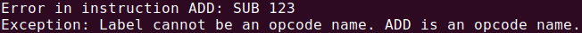

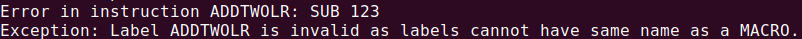

2. **Multiple label definitions**

This error occurs when a label is defined/declared multiple times. Label declaration includes statements such as `L1: ADD 589`


3. **Defined label names cannot be used as variable names and vice versa**

Since both label names and variable names can be alpha-numeric, it is possible for `ADD L4` and `BRN L4` can both be valid. To avoid this, an error is thrown if the label is declared as a variable before or vice versa.
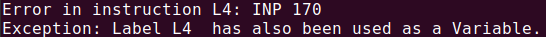

4. **Address supplied is out of bounds**

Since the maximum size of the memory is 8 bit, user cannot access memory cells greater than 256. This error is thrown if the user tries to access addresses greater than 4096 such as `SAC 12392`

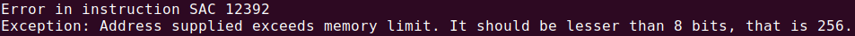

5. **Incorrect number of operands supplied for an opcode** 

This error will be throws in the parameters/arguments supplied to the argument is greater than or less than the number of arguments required by the opcode. For example `CLA 88` or `DIV`

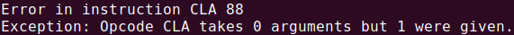

6. **Invalid opcode name/Macro name**

This error is thrown if the opcode supplied is not a macro call and neither is it a part of the available opcodes i.e. ['CLA',LAC','SAC','ADD','SUB','BRZ','BRN','BRP','INP','DSP','MUL','DIV','STP']
For example `WHDK 123`

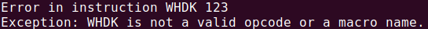

7. **END of program not found**

This error is throw if the assembly directive `END` is not found anywhere in the code.

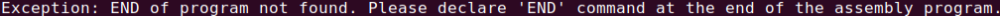

8. **Multiple macro definitions**

This error occurs when a macro is defined/declared multiple times. Macro declaration includes statements such as `ADDTWO MACRO ABC`


9. **Incorrect number of parameters supplied in a macro** 

This error occurs if the parameters supplied during the macro call does not match the number of parameters supplied during macro definition. For example: (consider the ADDTWO macro declared above) `ADDTWO 157 158` or `ADDTWO '5' '6' 192 102`

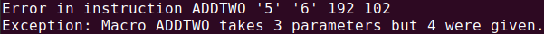

10. **Unidentified symbol used in a macro**

This error occurs if a symbol(variable) is used in a macro which is not a one of the parameters supplied. For example: (consider the ADDTWO macro declared above `ADDTWO MACRO A,B,C` and Macro call `ADDTWO 157, D,E`), `ADD F` will throw this error. 
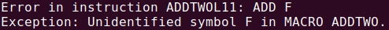

11. **MEND/ENDM for macro not found**

This error is thrown if the assembly directive `ENDM` or `MEND` to specify the end of a MACRO is not found anywhere in the code.
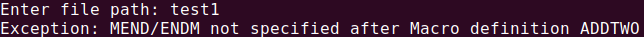

### Errors handled in second pass

1. **Not enough space for complete program**

This error is rare and will be thrown if the memory spaces occupied by the direct addresses, literals, symbols and instructions exceeds the total available memory or if there is no contiguous space available to fit all the instructions.

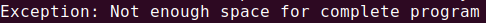

2. **Opcode can only have address/variable as operand**

Operands supplied for LAC, DSP, INP should be an address/variable only. No constants or labels allowed. For example, consider: `INP '110'` or `DSP L1` (provided, L1 is a defined label).
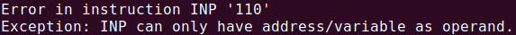
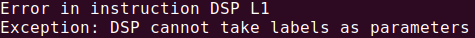

3. **Opcode can only have a valid label as operand**

Operands supplied for BRN, BRZ, BRP should have a defined and valid label. This error is thrown if the operand is anything but a defined label. For example, `BRZ 120` or `BRN L5` (provided, L5 is not a defined label).
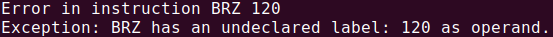
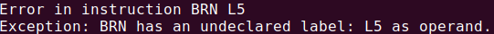

4. **Opcode can only have address or variable or constant as operand**

Operands supplied for ADD, MUL, SUB and DIV should be a defined address or a constant (not undefined address). For example, `ADD X` will throw an error if the variable `X` is undefined.
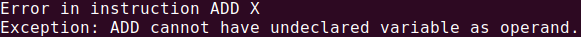

---
## Pseudocode
### First Pass
1. Open input file to read the file instruction by instruction.
2. Refine the instruction by checking for empty lines, comments, and assembler directives, while separating instructions into opcodes and corresponding operands.

```
def refine(instruction):  
	'''
	Input: Instruction

	Operation: Removes comments, splits instruction into opcode and operands.
    '''
```
3. Checking for presence of macro definitions, and generating the macro table if Macro definition is found.

```
def checkMacro(instruction):    
	'''
	Input: Instruction

	Operation: Checking for beginning and ending of Macro definition.
	'''
```
4. Assigning virtual addresses to each instruction, while checking for the presence of label declarations, adding operands to literal table/ symbol table/ data table, and handling Macro calls from the main code.

```
def getLabel(instruction):    
	'''
	Input: Instruction from instruction table

	Returns: True if label definition is found, else, returns False.
	'''
```
<br>

```
def addLabel(label, address,code,instruction): 
	'''
	Input: label name, label declaration address, part of program to which the label belongs (macro body/main).

	Operation: Adds detected label to the label table

	Throws exception if detected label is invalid:
		Already used as variable, 
	or, contains the name of a macro,
	or, has been defined more than once,
	or, has the same name as a valid opcode.
	'''
```
<br>

```
def addData(parameters,opcode):      
	'''
	Input: Opcode and operands following the opcode for given instruction.

	Operation: Adds operands to the dataTable/ symbolTable.

	Throws : Memory Address out of bounds error.
	'''
```

<br>

```
def getLiteral(token): 
	'''
	Input: Operand for given instruction.

	Returns: Literal if found, else, returns False.
	'''
```
<br>

```
def addLiteral(literal): 
	'''
	Input: Detected Literal.

	Operation: Adds newly detected literal to literal table.
	'''
```

<br>

```
def handleMacroCalls(name,parameters,num_ins):   
	'''
	Input: Macro name, macro parameters and number of instructions.

	Operation: Maps actual and formal parameters and expands the macro call in the instruction table.
	'''
```

### Second Pass
1. Calculate offset for instructions in instruction table.

```
def getOffset(num_ins):
	'''
	Input: Number of instructions present in instruction table.

	Returns: Offset/Starting address for instruction table, to be stored in a contiguous memory space.

	Throws "Not enough space" exception if instruction table size is larger than available memory, or if a contiguous memory space cannot be found.
	'''
```
2. Add calculated offset to map instruction and label virtual addresses to their physical addresses.
```
def addOffset(offset):
	'''
	Input: Offset calculated for binding of instructions and labels.

	Operation: Maps the instructions and labels in Instruction Table and Label Table to
	physical addresses by adding offset.
	'''
```

3. Find location for literal and variable pool and assign physical addresses and memory spaces to literals according to their size, and to variables.

```
def getLiteralPool(offset,num_ins):
	'''
	Input: offset for Instruction table and total number of instructions.

	Returns: Offset/Starting address for literal pool, to be stored in a contiguous memory space.

	Throws "Not enough space" exception if literal pool is larger than available memory, or if a contiguous memory space cannot be found.
	'''
```
<br>

```
def getSymbolPool(offset,literalPoolAdd,nextAdd,num_ins):
	'''
	Input: offset for Instruction table, literal pool starting and ending addresses, total number of instructions.

	Returns: Offset/Starting address for variables in symbol table, to be stored in a contiguous memory space.

	Throws "Not enough space" exception if variable pool is larger than available memory, or if a contiguous memory space cannot be found.
	'''
```
<br>

```
def assignLiteralPool(startAdd):
	'''
	Input: Starting address for literal pool

	Operation: Assigns physical addresses for literals for binding.
	'''
```
<br>

```
def assignSymbolPool(startAdd):
	'''
	Input: Starting address for variable pool

	Operation: Assigns physical addresses for variables for binding.
	'''
```

4. Remove label declarations from instructions in instruction table.

```
def removeLabelDefinitions():
	'''
	Operation: Removes label declarations from the instruction table for conversion to machine language.
	'''

```

5. Traverse the instruction table to check if operand(s) corresponding to instruction opcodes are valid undeclared/declared addresses/variables, or literals, or labels.

```
def checkOperands():
	'''
	Operation: Checks validity of operands corresponding to opcodes.
	ADD, MUL, LAC, SUB: Only have defined variables/addresses or literals.
	DSP: Only has defined variable/address.
	BRN, BRP, BRZ: Only have defined label.
	SAC, INP: Only have defined/undefined variables/addresses
	DIV: Only has first operand as defined variable/address or literal, second and third operands as 
	defined/undefined variables/addresses 
	'''

```
6. Traverse the instruction table instruction by instruction to:<br>
Convert assembly opcodes to corresponding machine language opcodes.<br>
Convert operands present in literal table/symbol table/data table/label table to their assigned physical addresses.<br> 

```
def convertOpcodes():
	'''
	Operation: Convert opcodes in instruction table to machine language.
	'''
```
<br>

```
def convertOperands():
	'''
	Operation: Convert operands to the physical adresses they are bound to.
	'''
```
7. Write the generated machine code to a text file.
```
def writeToFile():
	'''
	Operation: Write generated machine code to text file named:
	<sample_file>_output.txt
	Splits machine code into blocks of four bits for readability.
	'''
```
